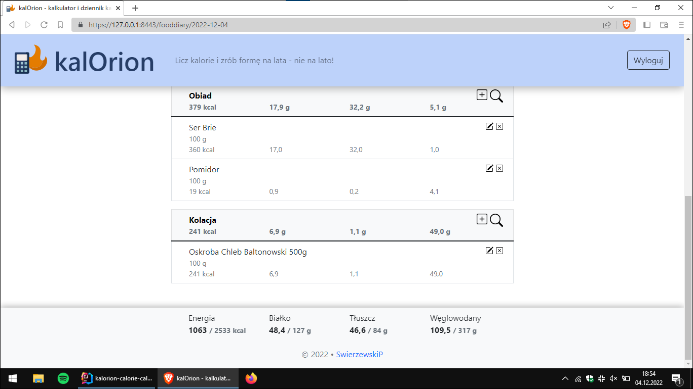
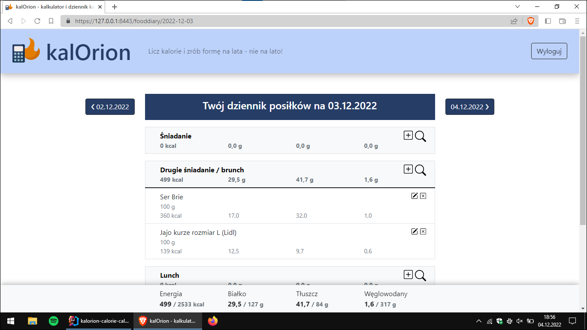

# kalOrion – calorie calculator & food diary

This application is designed to:
* calculate daily caloric requirement for user, based on user's age, weight, height, sex, physical activity level and diet goal,
* calculate total user's daily caloric and macro nutrients intake, based on user's meals weighted and added to food diary.

### Home screen

This first endpoint welcomes user and provides OAuth2 login with GitHub.

### User form

User fills his/her individual data, which is validated... 

and processed after submitting...

### Result screen

*Voila!* Our user now knows how many calories to eat daily (and how low he or she can go, while eating less to still be healthy).

### THE Food Diary

This view is the *meat and potatoes* (pun intended!) of my app, where all magic happens:
* Every meal has its kcal and macros calculated per weight.
* Every meal type (eg. breakfast, dinner etc.) has calculated its total kcal and nutrients.
* Then all is summed up and displayed as whole-day-total in this beautiful footer (total macros are calculated as default diet amounts – 20% protein / 30% fat / 50% carbohydrates).

### Edit meal form

Self explanatory!

### Edit product

Not so obvious... User can edit nutritional values per 100 g of product based on product label (assuming provided data isn't correct). This setting works globally for every user.

### Delete meal

Simple modal to delete meal from food diary.

### Technical stack:
- Java
- Spring Boot
- OAuth2
- Hibernate
- MySQL database
- Thymeleaf
- Bootstrap
- HTML, CSS
- GIT

###### Features to come soon:
- Add new meal/product
- Search for food from products